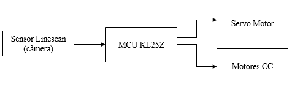

# Cedronics Team

Source code Cedronics Team from Freescale Cup Brazil 2013.

## Require

- CodeWarrior for MCU 10.4 [Download here!](https://drive.google.com/open?id=1CAAZywCCLJJJ9dUxb6GMovbbtYWvdGv3)
- Freedom Board (Freescale Processor Kinetis KL25Z)
- FRDM-TFC Board
- Linescan Sensor

## Others repositories

- [Freescale Cup Brazil 2015 (smartcar-with-cmos-camera)](https://github.com/ailtonbsj/smartcar-with-cmos-camera)

- [Freescale Cup Brazil 2014 (uranium-team)](https://github.com/ailtonbsj/uranium-team)

- [Processor Expert Samples](https://github.com/ailtonbsj/processor-expert-samples)

## Imagens

